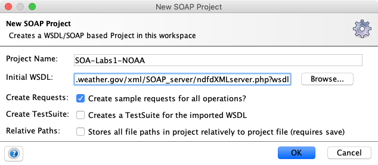

# Exercice 1 (SOAP-UI) : inspecter et invoquer des services web

Le site de la National Oceanic and Atmospheric Administration’s ([NOAA](http://mbaron.developpez.com/soa/intro/ "National Oceanic and Atmospheric Administration")) est un service du gouvernement des Etats-Unis qui fournit un accès à la base complète des conditions climatiques sur le sol américains. La NOAA fournit par le biais d’un service web SOAP des opérations permettant d’interroger cette base pour connaître, par exemple, le temps dans une région donnée. Dans cet exercice nous nous intéressons à appeler des opérations pour afficher les conditions météorologiques sur la ville de Manhattan. Consultez cette page <http://graphical.weather.gov/xml> pour obtenir des informations sur le service web SOAP.

## But

* Construire un projet SOAP-UI à partir de la description WSDL d’un service web SOAP.
* Invoquer des opérations d'un service web SOAP.

## Étapes à suivre

* Avant d’utiliser l’outil SOAP-UI, nous souhaitons vérifier que le document WSDL du service web SOAP de la NOAA est disponible. Par ailleurs, cela nous permettra de visualiser ce document. Ouvrir une instance de votre navigateur puis saisir l’URL : <http://graphical.weather.gov/xml/SOAP_server/ndfdXMLserver.php?wsdl>.

```xml
...
<operation name="NDFDgen">
    <documentation>Returns National Weather Service digital weather forecast data...</documentation>
    <input message="tns:NDFDgenRequest"/>
    <output message="tns:NDFDgenResponse"/>
  </operation>
  <operation name="NDFDgenLatLonList">
    <documentation>Returns National Weather Service digital weather forecast data...</documentation>
    <input message="tns:NDFDgenLatLonListRequest"/>
    <output message="tns:NDFDgenLatLonListResponse"/>
  </operation>
  <operation name="LatLonListSubgrid">
    <documentation>Returns a list of Latitude and longitude pairs for a rectangle defined by its lower left and upper right points...</documentation>
    <input message="tns:LatLonListSubgridRequest"/>
    <output message="tns:LatLonListSubgridResponse"/>
  </operation>
...
```

* Examiner le document WSDL en identifiant clairement les opérations disponibles.

* Démarrer ensuite l'outil **SOAP-UI** et construire un nouveau projet via le menu **File -> New soapUI Project**.

* Dans le champ *Project Name*, saisir le nom du projet `SOA-Labs1-NOAA`, puis valider (laisser les autres paramètres par défaut).

* Dans le champ *Initial WSDL/WADL*, saisir la précédente adresse de la description du service web SOAP : `http://graphical.weather.gov/xml/SOAP_server/ndfdXMLserver.php?wsdl`.



Une fois le projet créé, **SOAP-UI** génère toutes les opérations disponibles et crée un squelette de chaque requête.


* Nous pouvons dès à présent invoquer une opération de ce service web SOAP. Double-cliquer sur le nœud relatif à l’opération `LatLonListZipCode` puis sur le sous-nœud *Request 1*. Cette opération retourne des couples de valeurs *Latitude/Longitude* en fonction d’une liste de codes postaux américains.

* Dans le corps de l’élément `zipCodeList`, saisir la valeur `10001` qui correspond au code postal de la ville de New York puis soumettre le message SOAP.

* Vérifier le résultat de la réponse, les valeurs *Latitude/Longitude* doivent être `40.7198/-73.993`.

* Invoquer l’opération `NDFDgenByDay` qui retourne des prévisions météorologiques en fonction de la *latitude*, *longitude*, une *date*, une *durée* et un *format de date*. Utiliser les valeurs suivantes : *latitude* `40.7198` ; *longitude* `-73.993` ; *startDate* `YYYY-MM-DD` (où `YYYY` est l’année, `MM` est le mois et `DD` est le jour. Il faut mettre une date postérieure à la date du jour); *numDays* `1`, *unit* `m` et *format* `24 hourly`.

* Vérifier le résultat de la réponse, vous devriez obtenir des informations concernant la prévision météorologique sur la ville de New York (température, type de temps...).

* Invoquer l’opération `NDFDgenByDayLatLonList` qui retourne des informations météorologiques en fonction d’une liste de couple valeurs *latitude/longitude*, une *date*, une *durée* et un *format de date*. Récupérer les informations météorologiques de la ville de New York (`40.7198,-73.993`) et de la municipalité de Beverly Hills (*code zip* : `90210`). Les éléments de la liste *latitude/longitude* sont séparés par une virgule sans **espace**.

* Vérifier de nouveau le résultat obtenu. Vous devriez obtenir des informations concernant les prévisions météorologiques sur la ville de New York et sur la municipalité de Beveryly Hills.