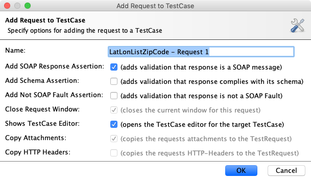
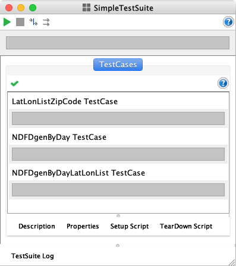
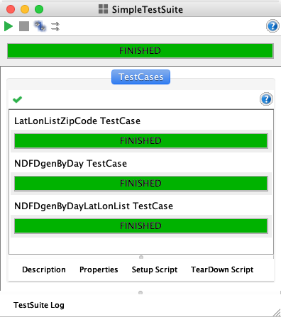
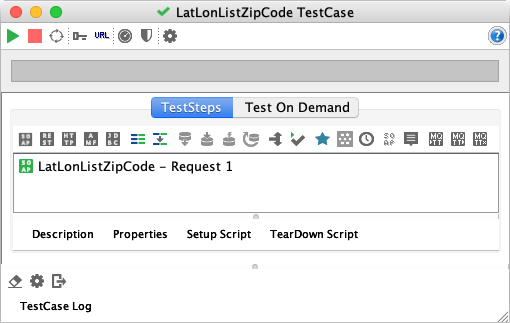
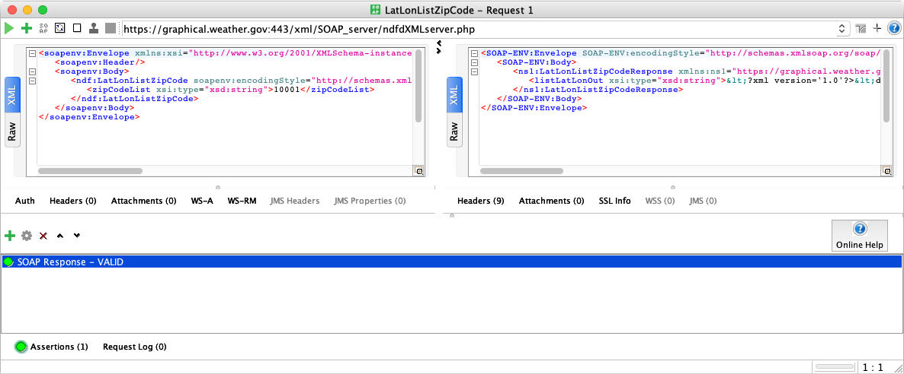
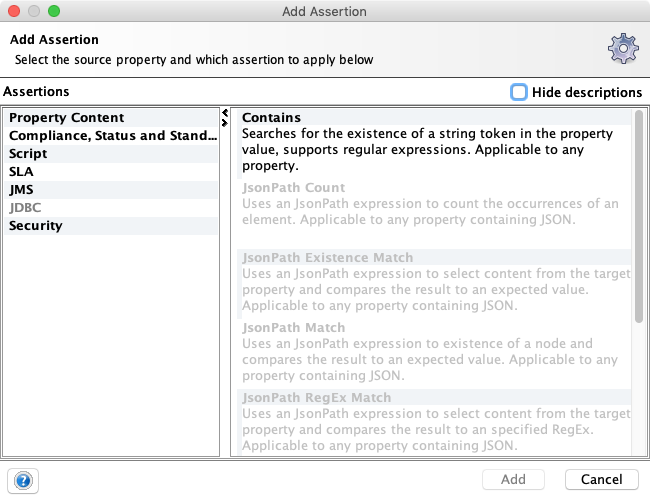
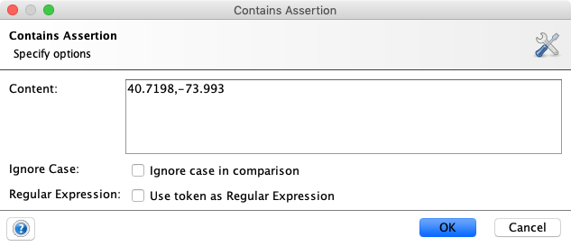

# Exercice 2 (SoapUI) : construire une suite de tests simple (TestSuite)

La création d’une suite de tests permet d’enchaîner un ensemble de cas de tests (TestCase). Un cas de test regroupe un ensemble d’étapes à réaliser. Cela peut correspondre par exemple à l’invocation d’une ou plusieurs opérations de service web SOAP. Cet exercice montre comment invoquer une opération et vérifier des assertions (contraintes qui doit être vérifiées) à travers une suite de tests.

## But

* Construire une suite de tests.
* Définir des assertions pour vérifier le bon fonctionnement du service web SOAP.

## Étapes à suivre

* Cliquer droit sur le nœud du projet `SOA-Labs1-NOAA` puis choisir **New TestSuite**. Saisir le nom `SimpleTestSuite` comme nom de la suite de tests.

* Pour ajouter un nouveau cas de test, nous allons réutiliser les valeurs liées aux précédentes invocations (voir exercice 1). Sélectionner la requête de l’opération `LatLonListZipCode`, cliquer droit et faire **Add to TestCase**.

* Une boîte de dialogue avec un composant à choix multiples est proposée. Choisir l'option **Simple TestSuite -> Create new TestCase** puis valider.

* Nommer le nouveau cas de test `LatLonListZipCode TestCase` puis valider.

* Laisser les paramètres par défaut (voir figure ci-dessous).

* Réitérer l’ajout d’un nouveau cas de test pour les opérations `NDFDgenByDay` et `NDFDgenByDayLatLonList` en nommant respectivement les cas de test `NDFDgenByDay TestCase` et `NDFDgenByDayLatLonList TestCase`. Vous devriez obtenir le résultat suivant pour la suite de test `SimpleTestSuite`.

* Les trois cas de test sont définis dans la suite de tests. Exécuter ces cas de tests (flèche verte en haut à gauche) et vous devriez réussir les invocations des opérations.

* À ce stade, seule l’exécution de l’opération est vérifiée. Une assertion peut être associée au résultat de manière à garantir que le test a réussi ou pas. Par défaut, seule l’assertion SOAP Response est définie. Cette assertion vérifie qu’un message SOAP est correctement retourné au client **SoapUI**. Double-cliquer sur la requête du cas de test `LatLonListZipCode TestCase` pour ouvrir le contenu de la requête SOAP.

* Cliquer sur le bouton **Assertions** situé en bas à gauche de la fenêtre requête ouverte précédemment.

* Ajouter une assertion `Contains` permettant de vérifier si une valeur donnée est présente dans la réponse. Cliquer droit sur la zone des assertions.

* Une boîte de dialogue **Contains Assertion** s’ouvre. Dans le champ *Content* indiquer la valeur `40.7198,-73.993`.

* Au niveau du message SOAP de la requête, changer la valeur contenue dans le corps de l’élément `zipCodeList` par la valeur `20001`.

* Exécuter de nouveau la suite de tests. Le cas de test `LastLonListZipCode TestCase` ne doit pas passer. L’assertion sur le contenu n’est pas correcte puisque la valeur `40.7198,-73.993` n’apparaît pas dans la réponse.

* Ajouter pour les deux autres opérations en cas de tests (`NDFDgenByDay TestCase` et `NDFDgenByDayLatLonList TestCase`), une assertion sur le contenu. Vous vérifierez notamment que le résultat SOAP de chaque opération retourne correctement les informations de localisation (balise `location`).