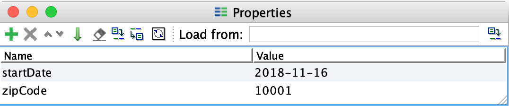
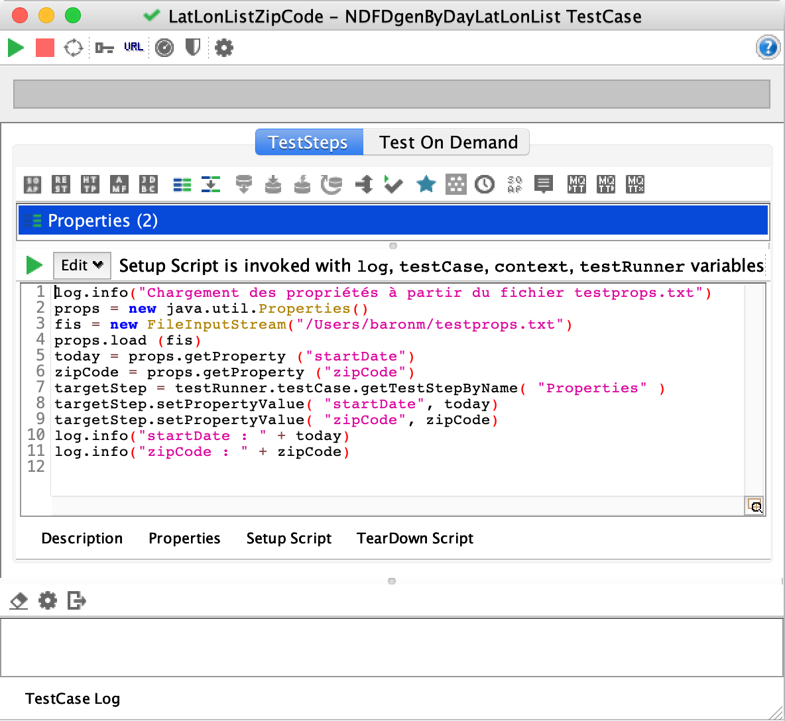
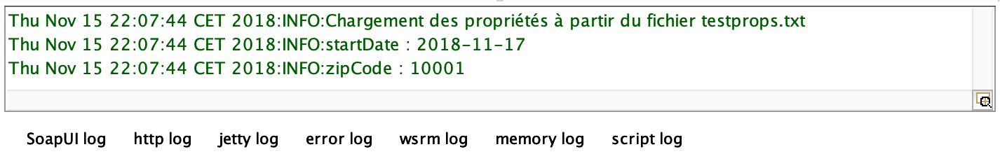
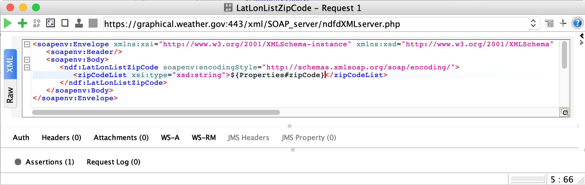
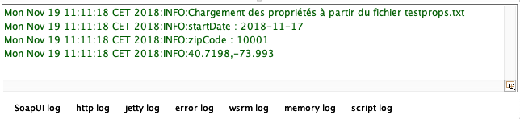
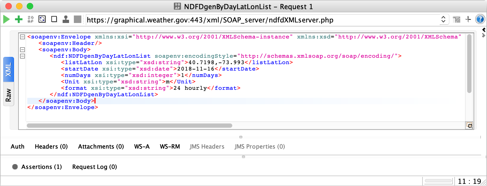
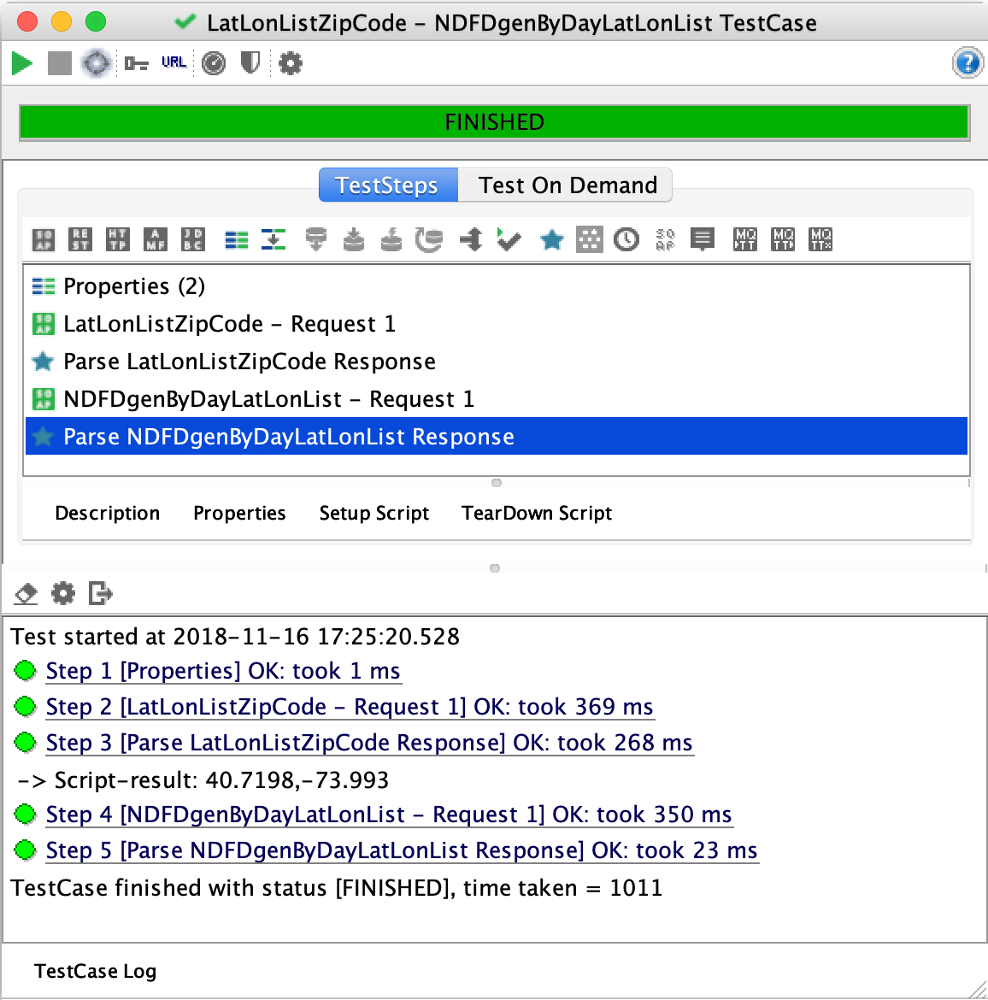

# Exercice 3 (SOAP-UI) : construire une suite de tests complexe (TestSuite)

Dans l'exercice 2, nous avons vu comment créer des cas de tests en ajoutant des assertions pour vérifier le bon fonctionnement d’une opération. Toutefois, dans les tests précédents l’enchaînement des opérations se fait de manière manuelle. La sortie d’une opération est transférée dans l’entrée d’une autre opération. Nous montrons ainsi dans cet exercice comment enchaîner les invocations des opérations `LatLonListZipCode` et `NDFDgenByDayLatLonList` en utilisant des scripts pour transférer automatiquement la sortie à l’entrée d’une opération.

## But

* Enchainer des appels à des opérations en séquence.
* Écrire des scripts SOAP-UI via le langage Groovy.

## Étapes à suivre

* À partir du projet `SOA-Labs1-NOAA`, créer une nouvelle suite de tests que vous appellerez `Complex TestSuite`.

* Définir dans cette suite de tests un cas de test nommé `LatLonListZipCode - NDFDgenByDayLatLonList TestCase`.

* Pour initialiser les entrées de l’opération `LatLonListZipCode` un fichier de propriétés est utilisé contenant la date de départ (*startDate*) et le code postal (*zipCode*). Ces valeurs sont chargées puis stockées dans la suite de tests. De cette façon pour changer les paramètres d’invocation il n’est plus nécessaire de modifier la configuration du projet **SOAP-UI**. Au niveau du nœud du cas de test, faire bouton droit de la souris, puis **Add Step** et enfin **Properties** (laisser le nom par défaut).

* Une nouvelle fenêtre **Properties** est affichée. Créer une propriété *startDate* dont la valeur par défaut est `2018-MM-DD` (jour qui suit la date du jour). Créer une seconde propriété `zipCode` dont la valeur par défaut est `10001`. Le résultat attendu est celui présenté sur la figure ci-dessous.



* Au niveau de la fenêtre du cas de test `LatLonListZipCode - NDFDgenByDayLatLonList TestCase` cliquer sur le bouton **Setup Script** et saisir le code Groovy ci-dessous qui permet de charger les propriétés d’un fichier et initialiser celles définies précédemment.

```groovy
log.info("Chargement des propriétés à partir du fichier testprops.txt")
props = new java.util.Properties()
fis = new FileInputStream("/home/soa/testprops.txt")
props.load (fis)
today = props.getProperty ("startDate")
zipCode = props.getProperty ("zipCode")
targetStep = testRunner.testCase.getTestStepByName( "Properties" )
targetStep.setPropertyValue( "startDate", today)
targetStep.setPropertyValue( "zipCode", zipCode)
log.info("startDate : " + today)
log.info("zipCode : " + zipCode)
```



* Créer à la racine de votre compte un fichier nommé *testprops.txt*.

* Modifier le contenu du fichier de la manière suivante.

```bash
startDate = 2018-11-17
zipCode = 10001
```

* Exécuter la suite de test et remarquer dans la console de log (script log) l’affichage des valeurs des propriétés `startDate` et `zipCode`.



* Ajouter au cas de tests en cours la requête de l’opération `LatLonListZipCode` (bien s’assurer de choisir le cas de test de la suite de test `ComplexTestSuite` sans créer de nouveau cas de tests). Une deuxième étape a été normalement ajoutée dans le cas de test.

* Modifier le message SOAP de la requête de ce deuxième cas de test de manière à ajouter la valeur `${Properties#zipCode}` dans la liste des codes postaux (voir résultat attendu sur la figure ci-dessous).

```xml
<soapenv:Envelope xmlns:xsi="http://www.w3.org/2001/XMLSchema-instance" xmlns:xsd="http://www.w3.org/2001/XMLSchema" xmlns:soapenv="http://schemas.xmlsoap.org/soap/envelope/" xmlns:ndf="https://graphical.weather.gov/xml/DWMLgen/wsdl/ndfdXML.wsdl">
   <soapenv:Header/>
   <soapenv:Body>
      <ndf:LatLonListZipCode soapenv:encodingStyle="http://schemas.xmlsoap.org/soap/encoding/">
         <zipCodeList xsi:type="xsd:string">${Properties#zipCode}</zipCodeList>
      </ndf:LatLonListZipCode>
   </soapenv:Body>
</soapenv:Envelope>
```



* Ajouter dans le cas de tests, une nouvelle étape qui est un script Groovy. Nommer ce script _Parse LatLonListZipCode Response_.

* Ajouter le code Groovy comme montré ci-dessous. Ce script extrait des informations issues de la réponse XML de l’opération appelée. Des assertions sont également réalisées pour assurer que la réponse soit correcte.

```groovy
groovyUtils = new com.eviware.soapui.support.GroovyUtils( context )
holder = groovyUtils.getXmlHolder("LatLonListZipCode - Request 1#Response" )
listLatLonOut = holder.getNodeValue( "//listLatLonOut" )
assert listLatLonOut != null
assert listLatLonOut.length() > 0
latlonNode = groovyUtils.getXmlHolder(listLatLonOut)
latlon = latlonNode.getNodeValue("//latLonList")
log.info(latlon)
assert latlon != null
context["latlon"] = latlon
```

* Exécuter la suite de test et s’assurer que dans la console de log la *latitude* et la *longitude* soient correctement affichées.



* Ajouter au cas de tests la requête de l’opération `NDFDgenByDayLatLonList`. Une quatrième étape a été ajoutée dans le cas de test.

* Modifier le message SOAP de la requête de ce quatrième cas de test de manière à ajouter la valeur `${latlon}` dans la liste des latitudes et longitudes (élément `listLatLon`), à ajouter la valeur `${Properties#startDate}` pour la date de départ (élément `startDate`), voir ci-dessous.

```xml
<soapenv:Envelope xmlns:xsi="http://www.w3.org/2001/XMLSchema-instance" xmlns:xsd="http://www.w3.org/2001/XMLSchema" xmlns:soapenv="http://schemas.xmlsoap.org/soap/envelope/" xmlns:ndf="https://graphical.weather.gov/xml/DWMLgen/wsdl/ndfdXML.wsdl">
   <soapenv:Header/>
   <soapenv:Body>
      <ndf:NDFDgenByDayLatLonList soapenv:encodingStyle="http://schemas.xmlsoap.org/soap/encoding/">
         <listLatLon xsi:type="xsd:string">${latlon}</listLatLon>
         <startDate xsi:type="xsd:date">${Properties#startDate}</startDate>
         <numDays xsi:type="xsd:integer">1</numDays>
         <Unit xsi:type="xsd:string">m</Unit>
         <format xsi:type="xsd:string">24 hourly</format>
      </ndf:NDFDgenByDayLatLonList>
   </soapenv:Body>
</soapenv:Envelope>
```



* Ajouter dans le cas de tests, une dernière étape qui est un script Groovy. Nommer ce script `Parse NDFDgenByDayLatLonList Response`.

* Ajouter le code Groovy comme montré ci-dessous. Ce script extrait des informations issues de la réponse XML et effectue des assertions (les deux dernières instructions) pour vérifier que le comportement de cette opération est correct.

```groovy
groovyUtils = new com.eviware.soapui.support.GroovyUtils( context )
holder = groovyUtils.getXmlHolder("NDFDgenByDayLatLonList - Request 1#Response" )
dwmlByDayOut = holder.getNodeValue( "//dwmlByDayOut" )
assert dwmlByDayOut.length() > 298
dwml = groovyUtils.getXmlHolder(dwmlByDayOut)
headTitle = dwml.getNodeValue("//head/product/title")
headField = dwml.getNodeValue("//head/product/field")
assert "NOAA's National Weather Service Forecast by 24 Hour Period".equals(headTitle)
assert "meteorological".equals(headField)
```

* Ouvrir l’éditeur de la suite de tests et exécuter la suite.


