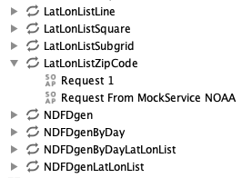
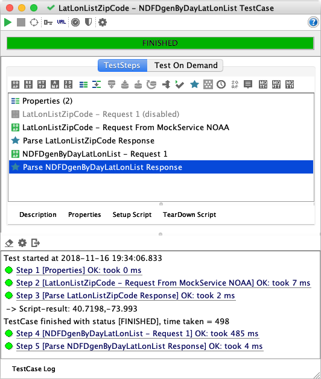

# Exercice 4 (SoapUI) : simuler un service web SOAP à partir de sa description WSDL

La simulation d’un service web SOAP est utilisée dans le cas où l’implémentation du service web n’est pas encore disponible ou si le service web SOAP est actuellement dans un état d’indisponibilité (serveur indisponible dû à une défaillance). Dans cet exercice nous considérons que l’appel à l’opération `LatLonListZipCode` n’est plus autorisé (opération en maintenance). Par conséquent nous mettons en place une simulation du comportement de cette opération.

## But

* Simuler un service web (MockService, MockResponse) à partir d’une description WSDL.

## Étapes à suivre

* À partir du projet `SOA-Labs1-NOAA`, cliquer droit et appeler **New SOAP MockService** que vous appelerez `MockService NOAA`.

* Choisir l’opération `LatLonListZipCode` dans la liste des opérations disponibles et faire **Add to MockService**.

* Une réponse est automatiquement créée (`Response 1`). Modifier le contenu en s’assurant que les valeurs de la *latitude* et de la *longitude* correspondent aux valeurs suivantes : `40.7198` et `-73.993`.

```xml
<SOAP-ENV:Envelope SOAP-ENV:encodingStyle="http://schemas.xmlsoap.org/soap/encoding/" xmlns:SOAP-ENV="http://schemas.xmlsoap.org/soap/envelope/" xmlns:xsd="http://www.w3.org/2001/XMLSchema" xmlns:xsi="http://www.w3.org/2001/XMLSchema-instance" xmlns:SOAP-ENC="http://schemas.xmlsoap.org/soap/encoding/">
   <SOAP-ENV:Body>
      <ns1:LatLonListZipCodeResponse xmlns:ns1="https://graphical.weather.gov/xml/DWMLgen/wsdl/ndfdXML.wsdl">
         <listLatLonOut xsi:type="xsd:string">&lt;?xml version='1.0'?>&lt;dwml version='1.0' xmlns:xsd='http://www.w3.org/2001/XMLSchema' xmlns:xsi='http://www.w3.org/2001/XMLSchema-instance' xsi:noNamespaceSchemaLocation='https://graphical.weather.gov/xml/DWMLgen/schema/DWML.xsd'>&lt;latLonList>40.7198,-73.993&lt;/latLonList>&lt;/dwml></listLatLonOut>
      </ns1:LatLonListZipCodeResponse>
   </SOAP-ENV:Body>
</SOAP-ENV:Envelope>
```

* Sélectionner la réponse (`Response 1`) de `MockService NOAA`, faire click droit puis **Open Request**.

* Choisir **Create New** et définir comme nom `Request From MockService NOAA`. Au niveau de l’opération `LatLonListZipCode` deux requêtes sont maintenant disponibles (voir figure ci-dessous).



* Ajouter la requête (`Request From MockService NOAA`) au cas de test `LatLonListZipCode - NDFDgenByDayLatLonList Test Case` défini dans l’exercice 3 (ComplexTestSuite).

* Déplacer la nouvelle requête de l’opération `LatLonListZipCode` en deuxième position puis désactiver la requête Request 1 (voir figure ci-dessous).



* Démarrer la simulation de `MockService NOAA` (bouton droit sur `MockService NOAA` puis **Start Minimized**).

* Exécuter la suite de tests pour visualiser le résultat.